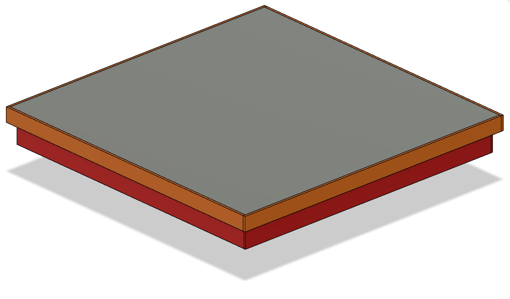

# CAD-Mechanics
here you can find the models we used to control our chess board.

- you can find the casing models in the **CASE-Assy** folder.

- and you can also find the parts of our mechanism in the **SCARA-Assy**

